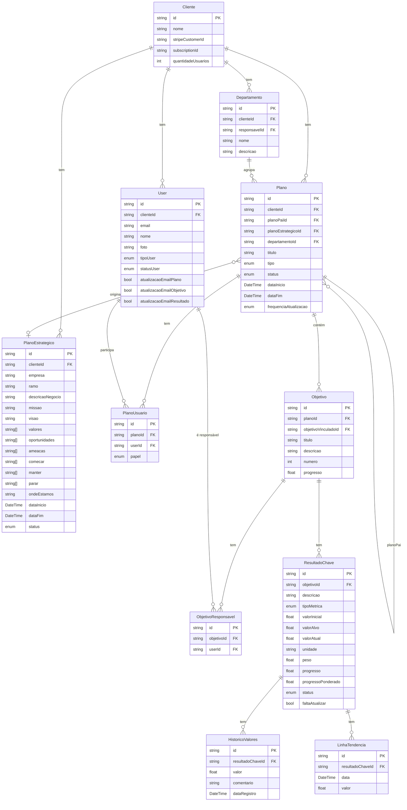
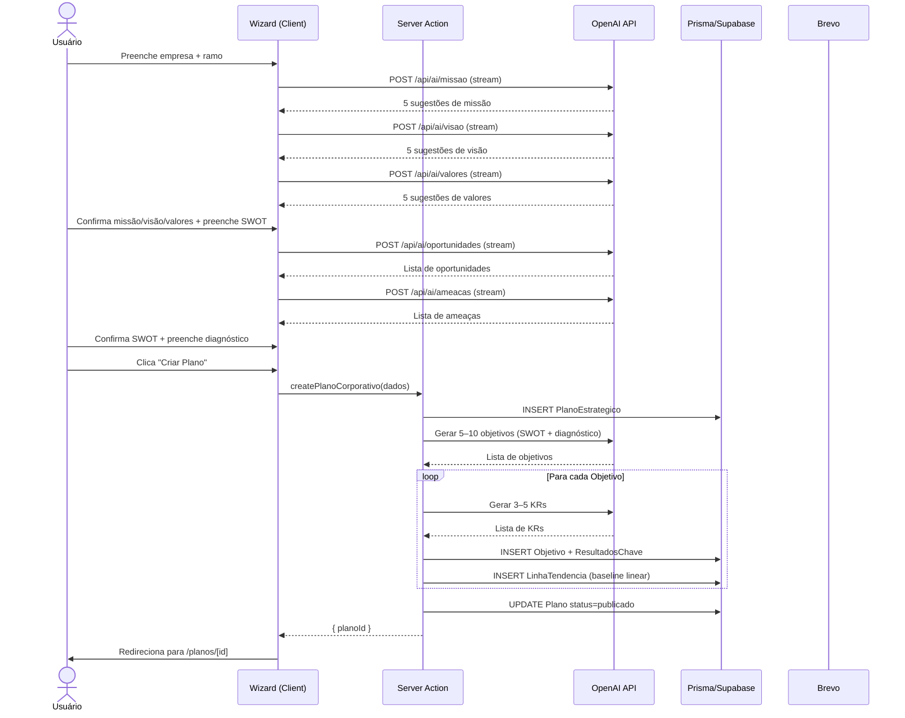
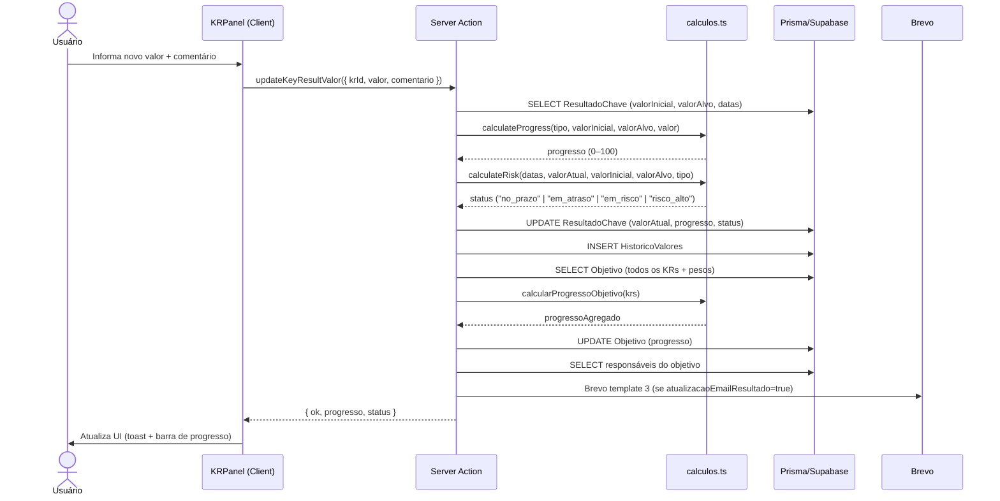
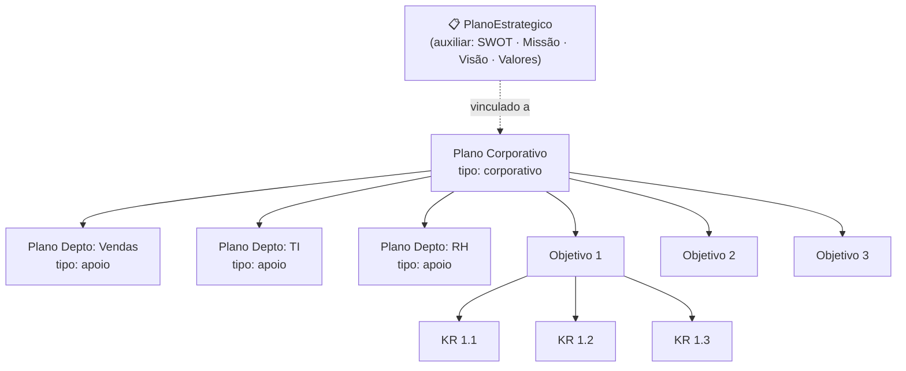

# Arquitetura do Sistema OKR

## 1. Visão Geral

SaaS multi-tenant para gestão de OKRs (Objectives and Key Results). Permite que empresas criem planos estratégicos com suporte de IA, acompanhem objetivos e resultados-chave, e gerenciem equipes responsáveis.

**Stack:** Next.js 14 (App Router) · PostgreSQL/Supabase · Prisma · Vitest · Playwright

---

## 2. Modelo de Domínio

### Hierarquia principal

```
Cliente (organização/tenant)
  └── Plano               ← hierárquico; um corporativo, N departamentais
        └── Objetivo      ← 3–10 por plano; tem responsáveis
              └── ResultadoChave   ← 3–5 por objetivo; progresso + risco
                    └── HistoricoValores   ← série temporal de atualizações

PlanoEstrategico          ← auxiliar; armazena os inputs do wizard (SWOT,
  └── linkado a Plano       missão, visão, valores) e fica vinculado ao plano
                            gerado pela IA. Não é pai na hierarquia.
```

### Entidades

| Entidade | Descrição |
|---|---|
| `Cliente` | Tenant raiz. Tem plano Stripe, lista de domínios, admins. |
| `User` | Pertence a um `Cliente`. Tem papel global (admin/membro) e papel por plano. |
| `PlanoEstrategico` | **Auxiliar.** Armazena os inputs do wizard: missão, visão, valores, SWOT, diagnóstico. Criado durante o fluxo de criação e vinculado ao `Plano` gerado. Pode ser consultado/editado depois, mas não é pai na hierarquia. |
| `Plano` | Unidade de planejamento. `tipo: corporativo \| apoio`. Campo `planoPaiId` cria hierarquia. `planoEstrategicoId` aponta para o PE que originou o plano (opcional para planos de departamento). |
| `Objetivo` | Título + descrição + progresso agregado. Tem N responsáveis (`User`). |
| `ResultadoChave` | Valor inicial, alvo, atual. `tipoMetrica: aumentar \| reduzir \| simNao`. |
| `HistoricoValores` | Uma linha por atualização de KR. Base do gráfico de evolução. |
| `LinhaTendencia` | Série de pontos calculados no momento da criação do KR (baseline linear). |
| `PlanoUsuario` | Relação N:N entre `Plano` e `User` com papel: `owner \| editor \| viewer`. |
| `Departamento` | Agrupador de planos de apoio. Tem um responsável. |

---

## 3. Fluxos Principais

### 3.1 Criação de Plano Estratégico (com IA)

```
Usuário preenche formulário multi-step
  → Passo 1: ramo de atuação + descrição do negócio
      → IA gera sugestões de Missão (5 opções)
      → IA gera sugestões de Visão (5 opções)
      → IA gera sugestões de Valores (5 opções)
  → Passo 2: SWOT
      → IA gera sugestões de Oportunidades
      → IA gera sugestões de Ameaças
      → Usuário adiciona forças/fraquezas manualmente
  → Passo 3: Diagnóstico
      → Campos: onde_estamos, comecar (lista), manter (lista), parar (lista)
  → Confirma → Server Action cria PlanoEstrategico no banco
  → IA gera 5–10 Objetivos baseados no SWOT + diagnóstico
  → Para cada Objetivo, IA gera 3–5 ResultadosChave
  → Persiste tudo; cria LinhaTendencia por KR
  → Plano publicado → usuário vai para tela de acompanhamento
```

### 3.2 Criação de Plano de Departamento

```
A partir de um Plano Corporativo existente:
  → Usuário seleciona departamento
  → IA gera 5–10 objetivos alinhados aos objetivos corporativos
  → Para cada Objetivo, IA gera 3–5 KRs
  → Plano criado com planoPaiId = id do plano corporativo
```

### 3.3 Acompanhamento de OKRs

```
Lista de planos → clique expande árvore (Plano → Objetivos → KRs)
  → Cada KR mostra: progresso atual, status de risco, última atualização
  → Atualizar KR: usuário informa novo valor + comentário
      → Calcula progresso e risco
      → Salva HistoricoValores
      → Recalcula progresso ponderado do Objetivo
      → Dispara notificação por email se configurado
```

### 3.4 Geração de Sugestão de Objetivo

```
Na tela de plano, usuário clica "Sugerir objetivo com IA"
  → Envia lista de objetivos existentes para a IA
  → IA retorna 1 objetivo diferente + 3–5 KRs
  → Usuário confirma ou descarta
```

### 3.5 Autenticação

```
Login por email/senha (Supabase Auth)
  → Criar conta → email de boas-vindas (Brevo template 2)
  → Convite → usuário recebe email (Brevo template 5) → cria senha
  → Esqueci senha → Supabase envia reset email
```

---

## 4. Cálculos de Negócio

### Progresso de um ResultadoChave

```
tipoMetrica = "aumentar":
  progresso = (valorAtual - valorInicial) / (valorAlvo - valorInicial) * 100

tipoMetrica = "reduzir":
  progresso = (1 - (valorAtual - valorAlvo) / (valorInicial - valorAlvo)) * 100

tipoMetrica = "simNao":
  progresso = valorAtual ? 100 : 0
```

### Status de Risco de um ResultadoChave

Baseado em quantos % atrás do esperado o KR está, dado o tempo decorrido:

```
valorEsperadoHoje = progresso_linear_para_a_data_de_hoje

diff = (valorAtual - valorEsperadoHoje) / valorEsperadoHoje

diff < -0.50  →  "risco_alto"    (>50% abaixo do esperado)
diff < -0.25  →  "em_risco"      (25–50% abaixo)
diff <  0.00  →  "em_atraso"     (0–25% abaixo)
diff >= 0.00  →  "no_prazo"
```

### Progresso de um Objetivo

```
progresso = média ponderada dos KRs:
  Σ(kr.progresso * kr.peso) / Σ(kr.peso)
```

### Linha de Tendência (baseline)

Gerada na criação do KR. Série linear de pontos entre `valorInicial` e `valorAlvo`:
- Se duração < 6 meses: 1 ponto por mês
- Se duração ≥ 6 meses: 6 pontos igualmente espaçados

---

## 5. Integrações Externas

| Serviço | Uso | Onde mockar nos testes |
|---|---|---|
| **OpenAI** (gpt-4o) | Geração de missão, visão, valores, SWOT, objetivos, KRs | `lib/openai.ts` → `vi.mock` |
| **Supabase Auth** | Login, cadastro, convite, reset de senha | `lib/supabase.ts` → `vi.mock` |
| **Brevo** | Emails transacionais (5 templates) | `lib/brevo.ts` → `vi.mock` |
| **Stripe** | Assinatura do cliente (fora do escopo MVP) | — |

### Templates de Email (Brevo)

| ID | Evento | Destinatário |
|---|---|---|
| 2 | Boas-vindas | Novo usuário |
| 3 | Acompanhamento do plano | Usuários do plano (se `atualizacaoEmailPlano = true`) |
| 4 | Planejamento LP | Lead da landing page |
| 5 | Convite para empresa | Usuário convidado |
| 7 | Responsável por objetivo | Usuário atribuído |

---

## 6. APIs Necessárias

Todas as mutações via **Server Actions**. API Routes apenas para webhooks e integrações externas.

### Server Actions

| Domínio | Action | Descrição |
|---|---|---|
| **auth** | `signIn` | Login por email/senha |
| **auth** | `signUp` | Cadastro + email boas-vindas |
| **auth** | `inviteUser` | Convida usuário para o cliente |
| **auth** | `resetPassword` | Inicia fluxo reset |
| **plano-estrategico** | `createPlanoEstrategico` | Cria PE com SWOT/missão/visão/valores |
| **plano-estrategico** | `updatePlanoEstrategico` | Edita campos do PE |
| **plano** | `createPlanoCorporativo` | Cria plano + gera objetivos/KRs via IA |
| **plano** | `createPlanoDepartamento` | Cria plano filho + gera objetivos via IA |
| **plano** | `updatePlano` | Edita título, datas, status |
| **plano** | `deletePlano` | Remove plano e cascata |
| **objetivo** | `createObjetivo` | Cria objetivo manualmente |
| **objetivo** | `suggestObjetivo` | IA sugere objetivo baseado nos existentes |
| **objetivo** | `updateObjetivo` | Edita título, descrição, responsáveis |
| **objetivo** | `deleteObjetivo` | Remove objetivo |
| **key-result** | `createKeyResult` | Cria KR + linha de tendência |
| **key-result** | `updateKeyResultValor` | Atualiza valor atual + salva histórico |
| **key-result** | `updateKeyResult` | Edita metadados do KR |
| **key-result** | `deleteKeyResult` | Remove KR |
| **usuarios** | `updateUserPermissions` | Altera papel do usuário no plano |
| **usuarios** | `removeUserFromPlano` | Remove usuário de um plano |

### API Routes (webhooks/externos)

| Método | Path | Propósito |
|---|---|---|
| POST | `/api/webhooks/brevo` | Recebe eventos de email do Brevo |
| POST | `/api/webhooks/stripe` | Eventos de assinatura Stripe |

### Rotas de IA (streaming)

| Método | Path | Propósito |
|---|---|---|
| POST | `/api/ai/missao` | Stream 5 sugestões de missão |
| POST | `/api/ai/visao` | Stream 5 sugestões de visão |
| POST | `/api/ai/valores` | Stream 5 sugestões de valores |
| POST | `/api/ai/oportunidades` | Stream sugestões de oportunidades |
| POST | `/api/ai/ameacas` | Stream sugestões de ameaças |
| POST | `/api/ai/objetivos` | Stream geração de objetivos |
| POST | `/api/ai/key-results` | Stream geração de KRs para um objetivo |
| POST | `/api/ai/sugerir-objetivo` | Stream 1 objetivo novo sugerido |

---

## 7. Decisões Arquiteturais

| Decisão | Escolha | Motivo |
|---|---|---|
| Mutações | Server Actions | Reduz boilerplate de API, tipagem end-to-end com Zod |
| IA streaming | Route Handlers com `ReadableStream` | UX responsiva; evita timeout em respostas longas |
| Multi-tenancy | Row-Level Security no Supabase | Isolamento por `clienteId` garantido no banco |
| Auth | Supabase Auth | Integra nativamente com RLS; suporta convite por email |
| ORM | Prisma | Type-safety, migrations versionadas, seed fácil |
| Testes unitários | Vitest | Performance, compatível com ESM, mock nativo |
| Testes E2E | Playwright | Suporte a múltiplos browsers, CI-friendly |

---

## 8. Estrutura de Pastas

```
/
├── src/
│   ├── app/                          # Next.js App Router
│   │   ├── (auth)/                   # Grupo: login, cadastro, reset
│   │   │   ├── login/page.tsx
│   │   │   ├── cadastro/page.tsx
│   │   │   └── reset-senha/page.tsx
│   │   ├── (app)/                    # Grupo: autenticado
│   │   │   ├── layout.tsx            # Layout com sidebar + navbar
│   │   │   ├── planos/
│   │   │   │   ├── page.tsx          # Lista de planos
│   │   │   │   └── [id]/
│   │   │   │       ├── page.tsx      # Acompanhamento OKRs
│   │   │   │       └── editar/page.tsx
│   │   │   ├── criador/
│   │   │   │   └── page.tsx          # Wizard criação de plano estratégico
│   │   │   └── usuarios/page.tsx
│   │   ├── api/
│   │   │   ├── ai/                   # Streaming IA
│   │   │   │   ├── missao/route.ts
│   │   │   │   ├── visao/route.ts
│   │   │   │   ├── valores/route.ts
│   │   │   │   ├── oportunidades/route.ts
│   │   │   │   ├── ameacas/route.ts
│   │   │   │   ├── objetivos/route.ts
│   │   │   │   ├── key-results/route.ts
│   │   │   │   └── sugerir-objetivo/route.ts
│   │   │   └── webhooks/
│   │   │       ├── brevo/route.ts
│   │   │       └── stripe/route.ts
│   │   └── layout.tsx                # Root layout (Sentry, PostHog, providers)
│   │
│   ├── features/                     # Domínios de negócio
│   │   ├── auth/
│   │   │   ├── actions.ts            # signIn, signUp, inviteUser, resetPassword
│   │   │   ├── components/           # LoginForm, CadastroForm, etc.
│   │   │   ├── hooks/
│   │   │   ├── schemas.ts            # Zod schemas
│   │   │   └── __tests__/
│   │   ├── plano-estrategico/
│   │   │   ├── actions.ts
│   │   │   ├── queries.ts            # Fetching server-side
│   │   │   ├── components/
│   │   │   ├── schemas.ts
│   │   │   └── __tests__/
│   │   ├── plano/
│   │   │   ├── actions.ts
│   │   │   ├── queries.ts
│   │   │   ├── components/
│   │   │   │   ├── PlanoTree.tsx     # Árvore expansível plano→obj→kr
│   │   │   │   ├── PlanoCard.tsx
│   │   │   │   └── EditarPlanoPanel.tsx
│   │   │   ├── schemas.ts
│   │   │   └── __tests__/
│   │   ├── objetivo/
│   │   │   ├── actions.ts
│   │   │   ├── queries.ts
│   │   │   ├── components/
│   │   │   │   ├── ObjetivoPanel.tsx
│   │   │   │   └── ResponsaveisSelector.tsx
│   │   │   ├── schemas.ts
│   │   │   └── __tests__/
│   │   ├── key-result/
│   │   │   ├── actions.ts
│   │   │   ├── queries.ts
│   │   │   ├── components/
│   │   │   │   ├── KRPanel.tsx
│   │   │   │   ├── AtualizarKRForm.tsx
│   │   │   │   └── ProgressoGrafico.tsx
│   │   │   ├── lib/
│   │   │   │   ├── calculos.ts       # calculate_progress, calculate_risk, linha_tendencia
│   │   │   │   └── calculos.test.ts
│   │   │   ├── schemas.ts
│   │   │   └── __tests__/
│   │   ├── usuarios/
│   │   │   ├── actions.ts
│   │   │   ├── queries.ts
│   │   │   ├── components/
│   │   │   └── __tests__/
│   │   └── criador-plano/            # Wizard multi-step
│   │       ├── actions.ts
│   │       ├── components/
│   │       │   ├── CriadorWizard.tsx
│   │       │   ├── steps/
│   │       │   │   ├── Step1Empresa.tsx
│   │       │   │   ├── Step2SWOT.tsx
│   │       │   │   └── Step3Diagnostico.tsx
│   │       │   └── SugestaoIA.tsx    # Componente de sugestão com streaming
│   │       ├── schemas.ts
│   │       └── __tests__/
│   │
│   ├── lib/
│   │   ├── prisma.ts                 # Singleton PrismaClient
│   │   ├── supabase.ts               # Supabase client (server + client)
│   │   ├── openai.ts                 # OpenAI client singleton
│   │   └── brevo.ts                  # Brevo email client
│   │
│   └── components/                   # UI compartilhado
│       ├── ui/                       # Primitivos (Button, Input, Modal, etc.)
│       ├── layout/                   # Sidebar, Navbar, PageHeader
│       └── feedback/                 # Toast, LoadingSpinner, ErrorBoundary
│
├── prisma/
│   ├── schema.prisma
│   ├── migrations/
│   └── seed.ts
│
├── tests/
│   └── e2e/                          # Playwright
│       ├── auth.spec.ts
│       ├── criar-plano.spec.ts
│       ├── acompanhamento.spec.ts
│       └── fixtures/
│
├── .github/
│   └── workflows/
│       └── ci.yml
│
├── vitest.config.ts
├── playwright.config.ts
└── .env.local
```

---

## 9. Diagramas

### 9.1 Modelo de Dados (ER)



### 9.2 Fluxo de Dados — Criação de Plano



### 9.3 Fluxo de Atualização de KR



### 9.4 Hierarquia de Planos


