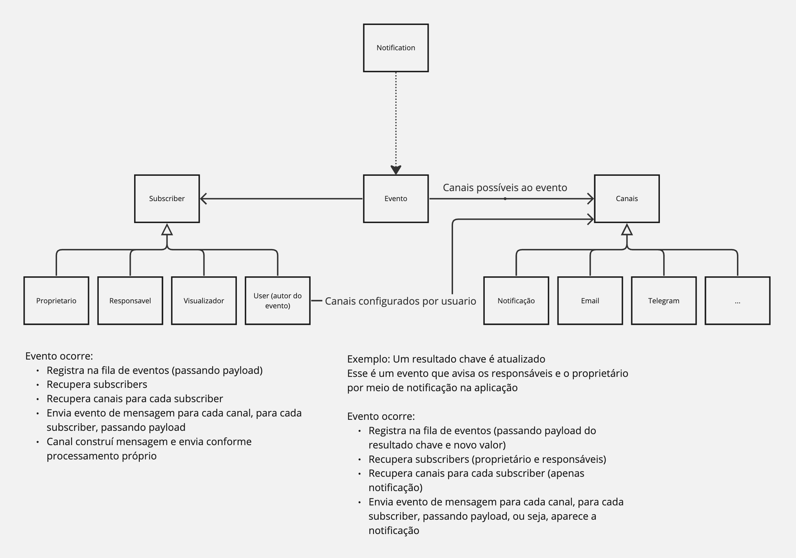

# Notification Service

O notification service tem como objetivo isolar para o sistema como as notificações deverão ser processadas.

O sistema gera um evento, passando o payload necessário e o NService cuida de entregar para os canais e para os subscribers corretos.

## Como criar um novo evento

### Canal e-mail

1. Crie o template de e-mail no Brevo
1. No módulo `canais.py` crie uma classe para o e-mail, filha de `CanalEmail`.
    1. Crie o método `notifica` que recebe `user` e mais um parametro genérico. Esse é o principal método para compor o e-mail.
    1. Nesse método, sete `self.email_service.subject` com o assunto do e-mail.
    1. Sete `self.email_service.params` com os demais parâmetros a serem utilizados no e-mail, dependendo da lógica.
    1. Crie o método `checa_autorizacao`, que verifica a autorização para o envio da mensagem na configuração do usuário.
1. Atualize o método `create_canal` em `CanalEmail`. Ele é uma `abstract factory` para canais. Observe que o modelo recebido deve corresponder ao código do modelo no Brevo e estar registrado na constante da classe.
1. No módulo `Evento.py` crie a classe filha referente ao evento registrando os subscribers e os canais no método `__init__`
1. Crie a chamada no EventoFactory
1. No módulo `test_canais.py`, inclua o teste para a notificação
1. No módulo `teste_eventos.py` inclua o testo do evento que envie o email.

### Chamando o evento
1. Na api ou onde for, use `EventoFactory().create_evento(EventoFactory().BOASVINDAS, user, data)` para criar o evento. `data` é a data da criação, se `None` será setada a data atual.
1. Chame `evento.execute`
## Componentes

*Notificaton*

Essa classe funciona como uma Queue falsa. Foi implementada para permitir que no futuro seja substituida por um sistema de mensageria. Sua função é receber a chamada do evento e instanciar os elementos do sistema. Como não funciona como um serviço temporizado (tipo chron), o processaneto da fila é imediato.

*Evento*

Super classe que representa um evento, cada evento específico é representado em uma subclasse. Cada evento pode ter multiplos canais e multiplos usuários

*Subscriber*

Representa para quem o evento deve ser entregue. Seu principal método é get_users, que devolve a lista de usuários

*Canais*

São os canais que entregam o evento para os usuários.
